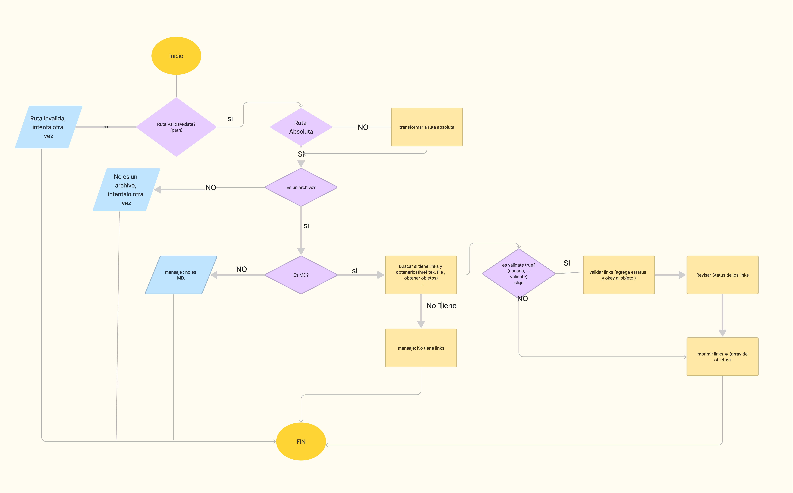

# Markdown Links

## Índice

* [1. Resumen del Proyecto](#1-Resumen del proyecto)
* [2. Diagrama de flujo](#2-Diagrama de flujo)
* [3. Modo de Uso](#3-Modo de Uso)

***

## 1. Resumen del proyecto

El presente Proyecto MdLinks, es una biblioteca diseñada para verificar si un archivo es de tipo MD, si contiene o no enlaces y determinando determinando el status en que se encuentra cada enlace del archivo MD, (likns en funcionamiento optimo, con error, o en estado de  broken).
Es un programa de líneas de comandos (CLI) y una biblioteca que permite analizar enlaces en archivos 'Markdown' (md.); Esta biblioteca se ha desarrollado en 'Node.JS'  y utiliza la API de Fetch para realizar las solicitudes HTTP

## 2. Diagrama de flujo

En este proyecto crearás una herramienta de línea de comando así como tu
propia librería (o biblioteca - library) en JavaScript.

 


## 3. Modo de Uso

Desde su Terminal Utilice el siguiente comando:

'npm cliMd.js', este le permitira verificar si los enlaces que se encuentran en el archivo MD. en que estado se encuentra cada uno. 
retornando un conjunto d etexto que contiene información de la URL encontrada, texto del link, ruta del archivo encontrado, un codigo HTTP y 'fail' en caso de fallo u 'OK' en caso de exito. 

  ```sh
   href: 'https://googlx.com',
    text: 'Error',
    file: 'C:\\Users\\carol\\Desktop\\Laboratoria\\DEV005-md-links-lite\\linksprueba.md',
    statusText: 'fail',
    status: '404'
  ```

  ```sh
   href: 'https://es.wikipedia.org/wiki/Markdown',
    text: 'Markdown',
    file: 'C:\\Users\\carol\\Desktop\\Laboratoria\\DEV005-md-links-lite\\linksprueba.md',
    status: 200,
    statusText: 'OK'
  ```